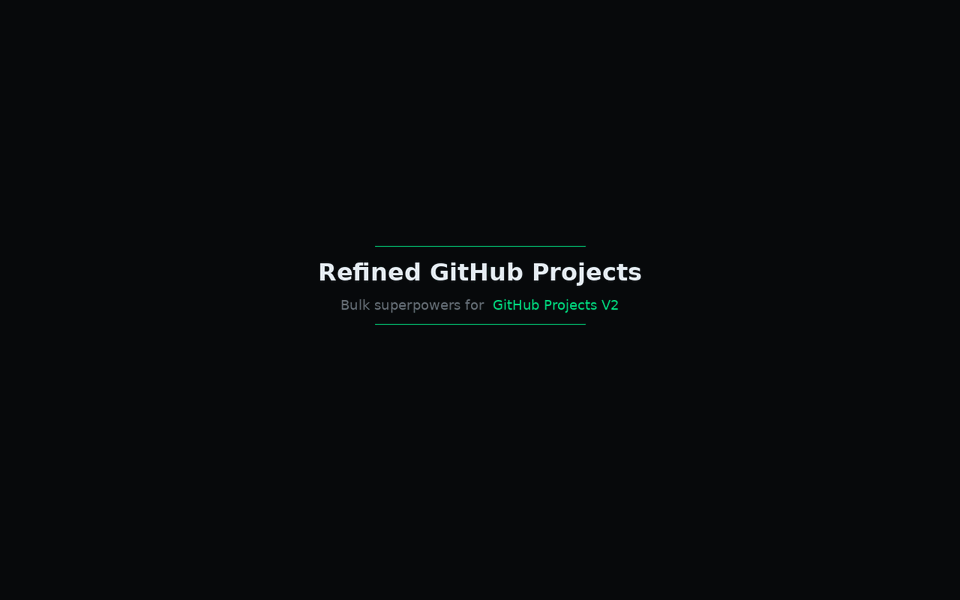
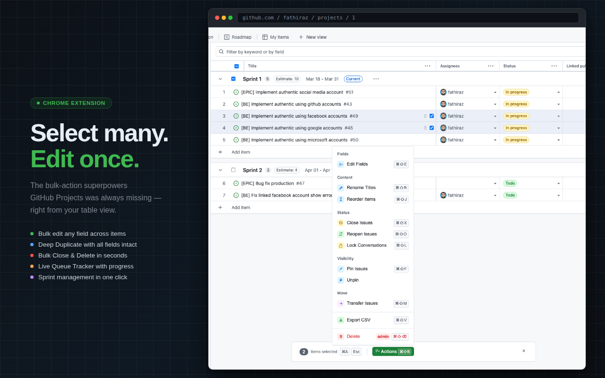
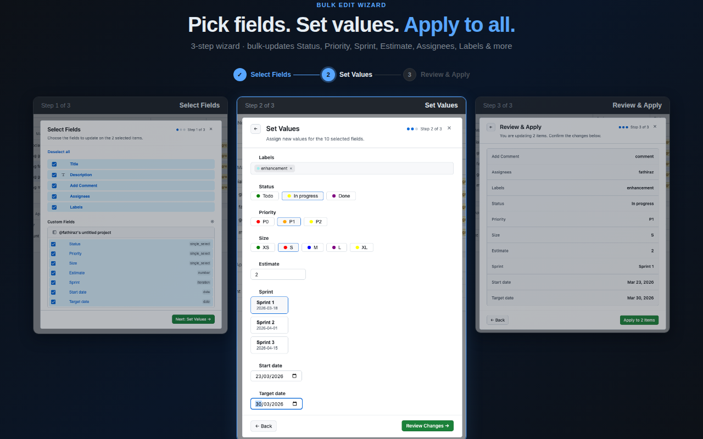
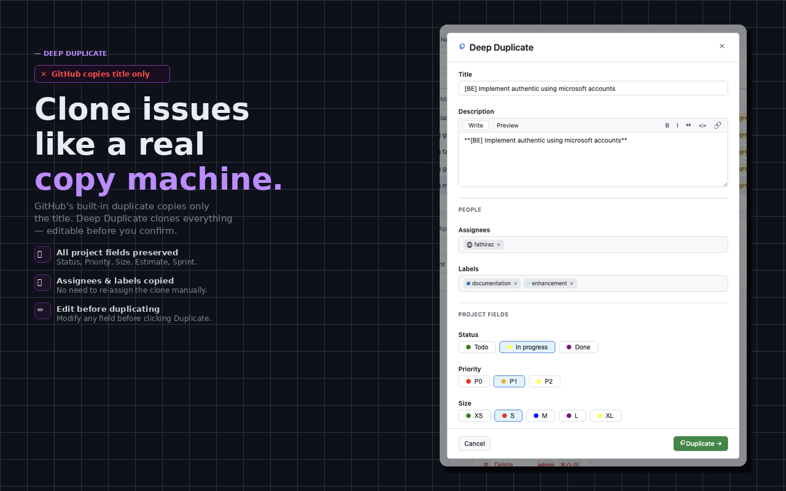
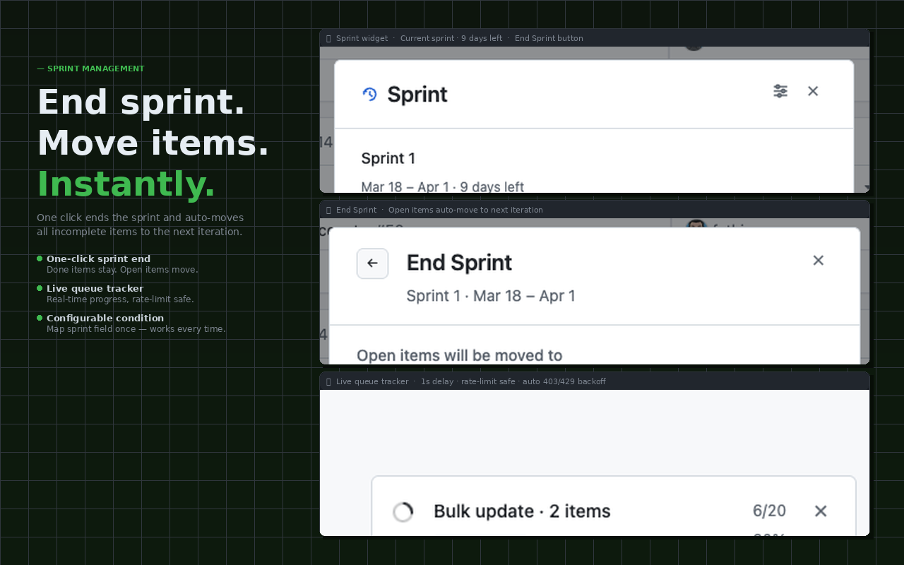

# Refined GitHub Projects

<p align="center">
  
</p>

<p align="center">
  <strong>GitHub Projects, bulk-edited the way it should work.</strong><br/>
  <em>Bulk edit, close, delete, duplicate, transfer, and sprint-manage your project items — all from the table view, no backend required.</em>
</p>

<p align="center">
  <a href="https://github.com/fathiraz/refined-github-projects/releases"></a>
  <a href="https://github.com/fathiraz/refined-github-projects/blob/main/LICENSE"></a>
  <a href="https://chromewebstore.google.com/detail/refined-github-projects/ljkfilkmedkcpckabpeeiacjefhnlplg"></a>
  <a href="https://addons.mozilla.org"></a>
</p>

<p align="center">
  <strong>Now live on the <a href="https://chromewebstore.google.com/detail/refined-github-projects/ljkfilkmedkcpckabpeeiacjefhnlplg">Chrome Web Store</a>.</strong>
  Manual install remains available for Edge, Firefox, and local builds.
</p>

<p align="center">
  <em>Inspired by <a href="https://github.com/refined-github/refined-github">refined-github</a> — the gold standard for browser extensions that fix what GitHub won't.<br/>
  ⚡ 90% built with multiple AI agents. By fathiraz.</em>
</p>

---

## 📋 Table of Contents

- [Why This Exists](#-why-this-exists)
- [Features](#-features)
- [Installation](#-installation)
- [Usage Guide](#-usage-guide)
- [Architecture](#️-architecture)
- [Tech Stack](#️-tech-stack)
- [Roadmap](#️-roadmap)
- [Contributing](#-contributing)
- [License](#-license)

---

## 🧐 Why This Exists

GitHub Projects V2 is a solid board — but editing items in bulk is painful. You update one field at a time. You close one issue at a time. You drag items to the next sprint one by one. That's not how teams move.

**Refined GitHub Projects** adds the bulk operations and sprint tooling that should have shipped with GitHub Projects V2 — running entirely in your browser, with your token never leaving your machine.

| Problem | What RGP adds |
|---------|---------------|
| Can't edit N items at once | **Bulk Edit Wizard** — select fields, set values, apply to all |
| GitHub's duplicate only copies the title | **Deep Duplicate** — clones all fields, assignees, labels, body |
| Closing a sprint takes many clicks | **End Sprint** — moves incomplete items to next iteration in one action |
| No visibility into background API calls | **Live Queue Tracker** — real-time progress, rate-limit safe |
| Dangerous operations have no guardrail | Every destructive action requires a confirmation modal |

---

## ✨ Features

| Feature | What it does |
|---------|-------------|
| **Bulk update fields** | Change Status, Assignee, Iteration, Priority, Labels, and any custom field across N items at once |
| **Bulk close issues** | Mark issues as Completed or Not Planned in a single click |
| **Bulk reopen issues** | Restore closed items back to active work |
| **Bulk lock / unlock** | Lock conversations with a reason (off-topic, too heated, resolved, spam) |
| **Bulk pin / unpin** | Promote or demote important issues at the repository level |
| **Bulk transfer** | Move issues to another repository, history intact |
| **Bulk delete** | Permanently remove items from your project |
| **Bulk rename titles** | Update issue or PR titles across multiple items |
| **Export to CSV** | Download selected items with all fields, assignees, labels, and custom properties |
| **Sprint management** | End a sprint with one click; incomplete items auto-assign to the next iteration |
| **Task completion tracker** | Live task counters in sprint group headers, updated in real time |
| **Deep duplicate** | Clone any item with all custom fields, assignees, labels, and sub-issue relationships |

---

### Bulk Actions Bar
Select items with `⌘A` / `Ctrl+A` — the floating bar appears. Hit **Actions** (`⌘⇧B`) to open the full menu.

<p align="center">
  
</p>

**Available bulk operations:**

| Category | Action | Shortcut |
|----------|--------|----------|
| Fields | Edit Fields | `⌘⇧E` |
| Content | Rename Titles | `⌘⇧R` |
| Content | Reorder Items | `⌘⇧J` |
| Status | Close Issues | `⌘⇧X` |
| Status | Reopen Issues | `⌘⇧O` |
| Status | Lock Conversations | `⌘⇧L` |
| Status | Unlock Conversations | — |
| Visibility | Pin Issues | `⌘⇧F` |
| Visibility | Unpin Issues | — |
| Move | Transfer Issues | `⌘⇧M` |
| Export | Export to CSV | `⌘⇧V` |
| Danger | Delete Items | `⌘⇧⌫` (admin only) |

---

### Bulk Edit Wizard (3-Step Flow)

<p align="center">
  
</p>

1. **Select Fields** — choose which standard and custom fields to update
2. **Set Values** — pick new values: Status, Priority, Sprint, Size, Estimate, Assignees, Labels, dates…
3. **Review & Apply** — see a clean diff of every change before a single API call fires

---

### Deep Duplicate

<p align="center">
  
</p>

GitHub's native duplicate copies only the title. Deep Duplicate clones the full issue — all project fields, assignees, labels, body, and sub-issue links — and lets you edit everything before confirming.

---

### Sprint Management

<p align="center">
  
</p>

End a sprint with one click. The **Sprint** widget (top-right on any Projects page) shows the active iteration and task completion. Hit **End Sprint**, pick the target iteration for incomplete items, and the background queue moves them automatically — no manual re-assignment.

---

### Live Queue Tracker

Every bulk operation runs through a sequential background queue with 1-second delays between mutations. The live tracker shows real-time percentage progress and automatically backs off on 403 / 429 errors — keeping your PAT safe on large projects.

---

### Privacy by Design

- **No backend** — all calls go directly from your browser to `api.github.com`
- **Token stays local** — the PAT is stored in browser extension storage, never sent to any external server
- **Shadow DOM isolated** — injected UI never clashes with GitHub's own styles

---

## 🚀 Installation

### Browser Compatibility

| Browser | Engine | Install path |
|---------|--------|--------------|
| Chrome | Chromium | ✅ Chrome Web Store |
| Arc | Chromium | ✅ Chrome Web Store |
| Microsoft Edge | Chromium | ✅ Manual install |
| Firefox | Gecko | ✅ Manual install |
| Zen | Firefox (Gecko) | ✅ Manual install |

### For Humans

1. **Chrome**: install directly from the [Chrome Web Store](https://chromewebstore.google.com/detail/refined-github-projects/ljkfilkmedkcpckabpeeiacjefhnlplg).
2. **Edge / Firefox / local testing**: download the latest browser build package from [Releases](https://github.com/fathiraz/refined-github-projects/releases) and extract it on your machine.
3. For manual installs, open your browser's extension page:
   - **Chrome**: `chrome://extensions`
   - **Edge**: `edge://extensions`
   - **Firefox / Zen**: `about:debugging#/runtime/this-firefox`
4. Load the extension manually when needed:
   - **Chrome / Edge**: enable **Developer mode** → **Load unpacked** → select the extracted folder
   - **Firefox / Zen**: **Load Temporary Add-on** → select the manifest file in the extracted folder
5. Click the extension icon, paste your GitHub PAT, and click **Validate and save**.

Done. Chrome installs in one click from the Chrome Web Store; Edge and Firefox remain available via manual install.

### For AI Agents

Paste this into Cursor, Claude Code, or any coding agent:

```text
Install Refined GitHub Projects from the Chrome Web Store:
https://chromewebstore.google.com/detail/refined-github-projects/ljkfilkmedkcpckabpeeiacjefhnlplg

If you need Edge, Firefox, or a local build, use the latest GitHub release:
https://github.com/fathiraz/refined-github-projects/releases

Steps:
1. Chrome: install from the Chrome Web Store
2. Edge/Firefox/manual installs: download the latest browser build package (not the source archive) and extract it
3. Load as unpacked extension when needed:
   - Chrome: chrome://extensions → Developer mode → Load unpacked → select extracted folder
   - Edge: edge://extensions → Developer mode → Load unpacked → select extracted folder
   - Firefox: about:debugging#/runtime/this-firefox → Load Temporary Add-on → select manifest.json
4. Click the extension icon → paste your GitHub PAT (scopes: repo, read:org, project) → Validate and save
```

Or fetch these instructions directly:

```bash
curl -sL https://raw.githubusercontent.com/fathiraz/refined-github-projects/main/README.md
```

### Development Setup

```bash
# Prerequisites: Node.js 18+, pnpm

git clone https://github.com/fathiraz/refined-github-projects.git
cd refined-github-projects

pnpm install

# Dev server with hot reload
pnpm dev

# Production build
pnpm build
```

Load `.output/chrome-mv3` in `chrome://extensions` or `edge://extensions`, or load the Firefox output in `about:debugging`.

If you want to use Safari manually, follow the [WXT Safari publishing guide](https://wxt.dev/guide/essentials/publishing.html#safari).

---

## 📖 Usage Guide

### Setting Up Your PAT

1. GitHub → **Settings** → **Developer settings** → **Personal access tokens** → **Tokens (classic)**
2. **Generate new token (classic)**
3. Name it `Refined GitHub Projects` and select the required scopes:

| Scope | Reason |
|-------|--------|
| `repo` | Read/write issues, labels, assignees |
| `read:org` | Read organization membership for assignee search |
| `project` | Read/write GitHub Projects V2 fields |

4. Copy the token and paste it into the extension popup → **Validate and save**.

### Running a Bulk Operation

1. Open any GitHub Projects **table view**
2. Check item checkboxes — or press `⌘A` / `Ctrl+A` to select all
3. The **Bulk Actions Bar** appears at the bottom
4. Click **Actions** (`⌘⇧B`) and choose your operation
5. Follow the wizard; review changes before confirming

### Ending a Sprint

1. The **Sprint** widget appears top-right on your Projects page
2. Click **End Sprint**
3. Choose the target iteration for incomplete items
4. Click **End Sprint** — incomplete items move automatically

### Keyboard Shortcuts

| Shortcut | Action |
|----------|--------|
| `⌘A` / `Ctrl+A` | Select all visible items |
| `⌘⇧B` | Open Actions menu |
| `Esc` | Clear selection |

---

## 🏗️ Architecture

```
┌─────────────────┐     sendMessage      ┌──────────────────────────┐     ┌──────────────────────┐
│  Content Script │ ──────────────────→  │  Background Service      │ ──→ │  GitHub GraphQL API  │
│  (DOM / UI)     │                      │  Worker                  │     │  api.github.com      │
│                 │ ←──────────────────  │  - PAT storage           │     │                      │
│  - Shadow DOM   │    response /        │  - Sequential queue      │     │                      │
│  - Row observer │    queueStateUpdate  │  - 403/429 backoff       │     │                      │
└─────────────────┘                      └──────────────────────────┘     └──────────────────────┘
         ↑
         │ WXT Storage API
         ↓
┌─────────────────┐
│  Extension      │
│  Popup          │
│  - PAT config   │
└─────────────────┘
```

**Data flow:**

1. The **Content Script** observes the GitHub Projects DOM via `MutationObserver` and injects UI into a Shadow DOM container — invisible to GitHub's own styles.
2. On a bulk operation, the content script sends a typed message to the **Background Service Worker**.
3. The Background Worker retrieves the stored PAT, builds a sequential task queue, and fires GraphQL mutations with 1 s delays between each write. `Promise.all()` is never used for mutations — it will 403-ban your token.
4. Progress is broadcast back as `queueStateUpdate` messages, driving the live tracker widget.

---

## 🛠️ Tech Stack

| Layer | Technology |
|-------|-----------|
| Extension framework | [WXT](https://wxt.dev/) with Manifest V3 |
| UI | React 18, TypeScript, [Primer CSS](https://primer.style/) |
| Messaging | [@webext-core/messaging](https://webext-core.aklinker1.io/) |
| Storage | WXT browser storage APIs |
| API | GitHub Projects V2 GraphQL via `fetch` |
| DOM isolation | WXT CSUI with Shadow DOM |
| Background | WXT Background Service Workers |

---

## 🗺️ Roadmap

- [x] Bulk update fields (Status, Assignee, Sprint, Priority, Labels, custom fields)
- [x] Bulk close / reopen issues
- [x] Bulk lock / pin / unpin issues
- [x] Bulk transfer issues to another repository
- [x] Bulk delete project items
- [x] Bulk rename titles
- [x] Reorder items
- [x] Export selected items to CSV
- [x] Deep duplicate with all fields, assignees, labels, body, sub-issues
- [x] Sprint management — end sprint with auto-assignment of incomplete items
- [x] Task completion tracker in sprint group headers
- [x] Live queue tracker with real-time progress
- [x] Chrome Web Store release
- [ ] Firefox Add-ons release

---

## 🤝 Contributing

Contributions are welcome. Please follow these rules — they exist to keep the extension safe for everyone.

1. Fork the repository
2. Create a feature branch: `git checkout -b feature/my-feature`
3. Make your changes and run `pnpm typecheck`
4. Commit with a conventional message: `git commit -m 'feat: my feature'`
5. Push and open a pull request

**Critical rules (strictly enforced):**

- **Never** use `Promise.all()` for GraphQL mutations — GitHub will 403-ban your PAT
- All mutations must run sequentially through the background queue with `sleep(1000)` between each
- **Never** call GitHub's API directly from a Content Script — always use `sendMessage` to the Background Worker
- Anchor injected UI to `data-testid` attributes or ARIA labels, not volatile CSS class names

---

## 📄 License

MIT © [fathiraz](https://github.com/fathiraz)

---

## 🙏 Acknowledgments

- [refined-github](https://github.com/refined-github/refined-github) — the gold standard for browser extensions that meaningfully improve GitHub's UX
- [WXT](https://wxt.dev/) — made cross-browser Manifest V3 development actually enjoyable
- [Primer CSS / @primer/react](https://primer.style/) — GitHub's own design system, so the injected UI feels native
- [GitHub GraphQL API](https://docs.github.com/en/graphql) — the Projects V2 API that makes all of this possible

---

<p align="center">
  <strong>fathiraz</strong> · <a href="https://github.com/fathiraz">github.com/fathiraz</a> · <a href="https://github.com/fathiraz/refined-github-projects">Project repository</a>
</p>