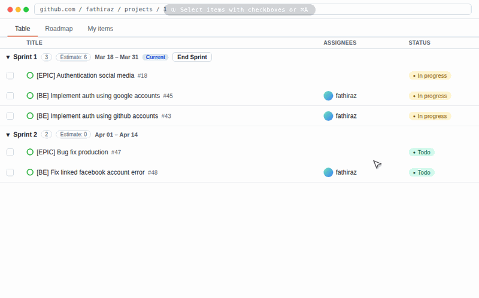
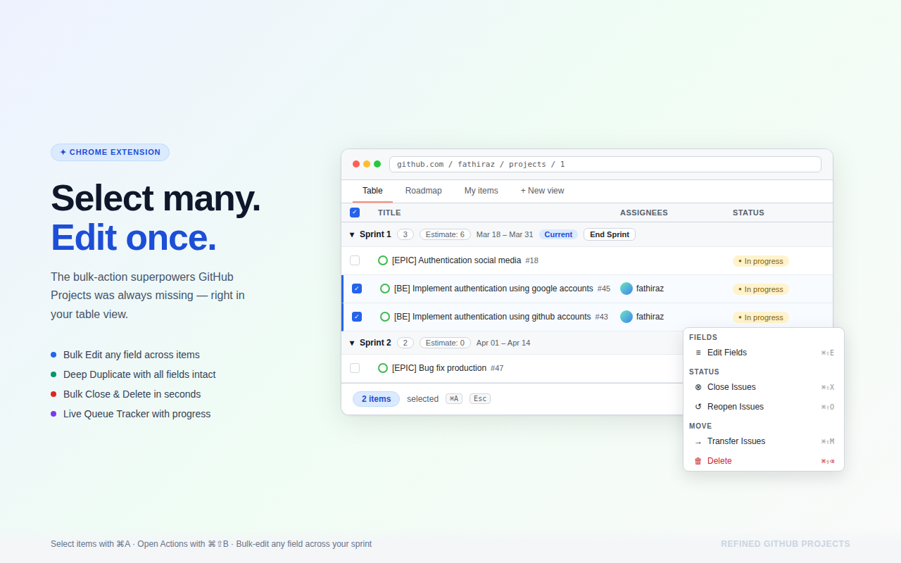
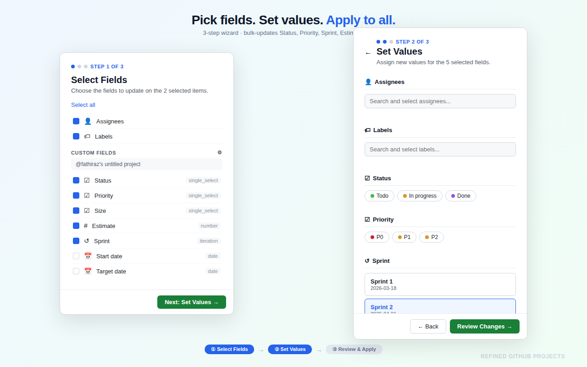
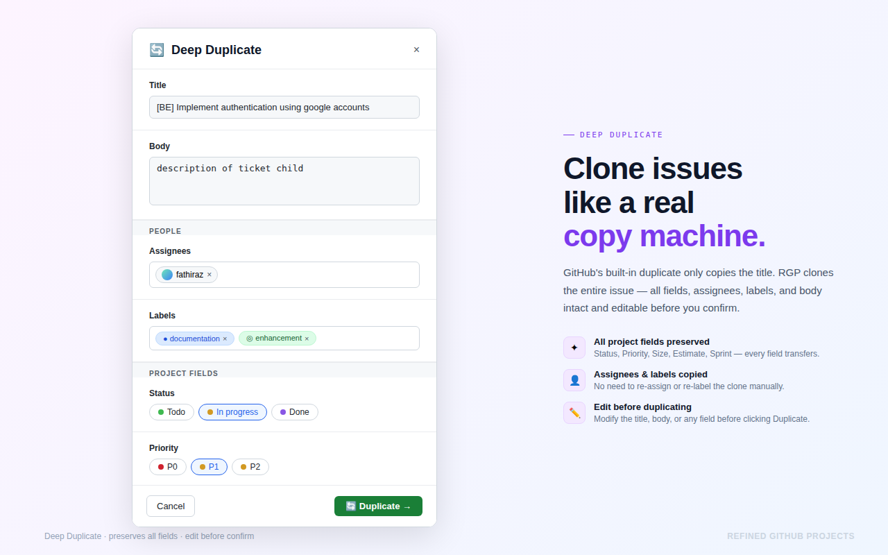
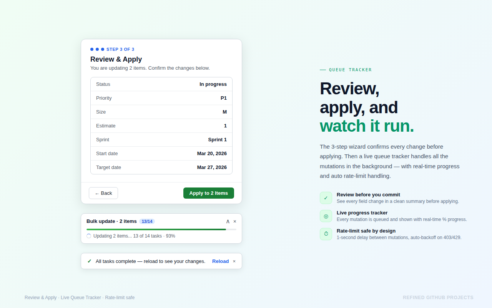
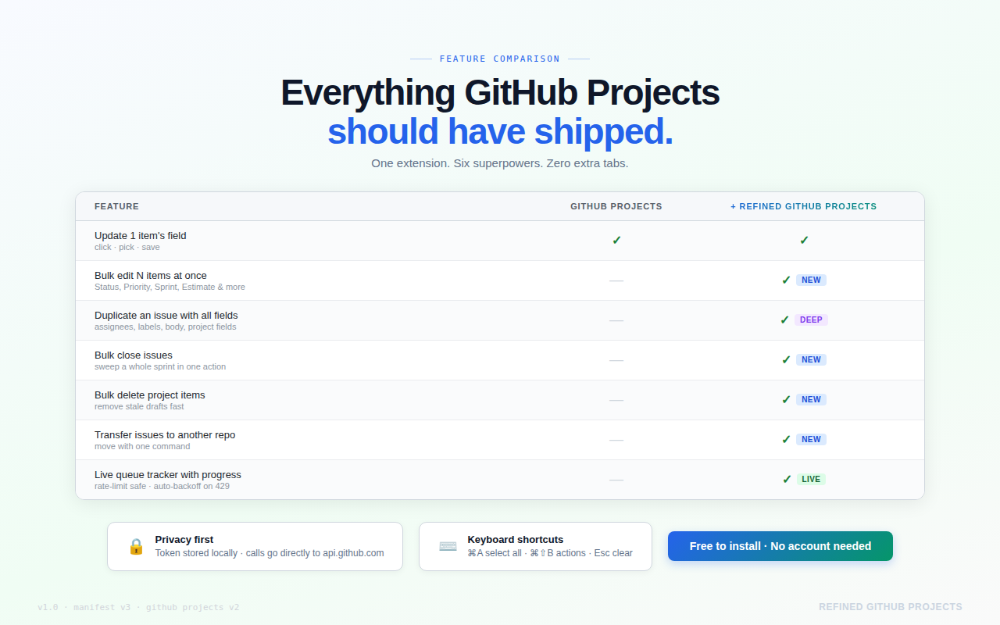
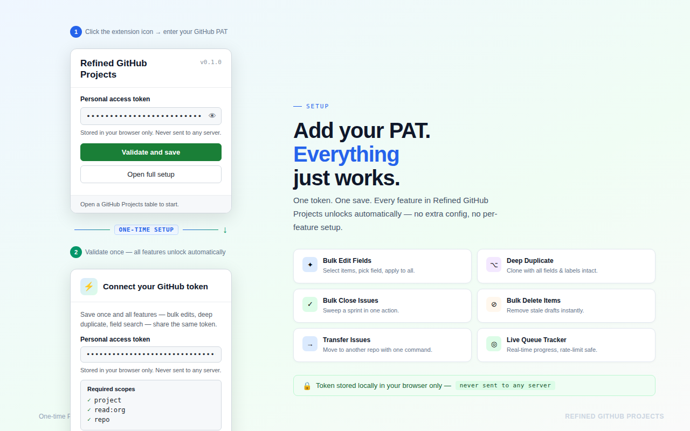

# Refined GitHub Projects

<p align="center">
  
</p>

<p align="center">
  <em>GitHub Projects, but the way it should work.</em>
</p>

<p align="center">
  <a href="https://chrome.google.com/webstore"></a>
  <a href="https://addons.mozilla.org"></a>
  <a href="https://microsoftedge.microsoft.com/addons"></a>
</p>

<p align="center">
  Bulk edit, close, delete, and deep duplicate GitHub Projects items — all from the table view.
</p>

<p align="center">
  <em>Inspired by <a href="https://github.com/refined-github/refined-github">refined-github</a> — the gold standard for browser extensions that fix what GitHub won't.</em><br/>
  ⚡ 90% built with multiple AI agents. By <a href="https://github.com/fathiraz">fathiraz</a>.
</p>

---

## 📋 Table of Contents

- [About The Project](#-about-the-project)
- [Feature Highlights](#-feature-highlights)
- [Architecture](#️-architecture)
- [Tech Stack](#️-tech-stack)
- [Getting Started](#-getting-started)
- [Usage Guide](#-usage-guide)
- [Roadmap](#️-roadmap)
- [Contributing](#-contributing)
- [License](#-license)
- [Contact](#-contact)
- [Acknowledgments](#-acknowledgments)

---

## 🧐 About The Project

GitHub Projects V2 is powerful, but managing dozens or hundreds of items is painful. You can update one field at a time, close one issue at a time, and manually drag items between sprints. That's not how teams work.

**Refined GitHub Projects** adds the bulk operations and sprint tooling that GitHub's project boards should have shipped with — without touching a single API key on a server.

### Why Refined GitHub Projects?

- **No backend required** — all API calls go directly from your browser to `api.github.com`
- **Your token stays local** — the PAT is stored in your browser's extension storage and never leaves your machine
- **Rate-limit safe** — a sequential queue with 1 s delays and automatic 403/429 backoff protects your token on large projects
- **Shadow DOM isolated** — injected UI never clashes with GitHub's own styles

### Who Is It For?

- Engineering teams using GitHub Projects V2 for sprint planning
- Developers who manage large backlogs and want Jira-level bulk operations without leaving GitHub
- Anyone who has ever wished the "select all" checkbox in GitHub Projects actually did something useful

---

## ✨ Feature Highlights

- **Bulk update fields** — change Status, Assignee, Iteration, Priority, Labels, and any custom field across N items at once
- **Bulk close issues** — mark issues as *Completed* or *Not Planned* in a single click
- **Bulk reopen issues** — restore closed items back to active work
- **Bulk lock / unlock** — lock conversations with a reason (off-topic, too heated, resolved, spam)
- **Bulk pin / unpin** — promote or demote important issues at the repository level
- **Bulk transfer** — move issues to another repository, history intact
- **Bulk delete** — permanently remove items from your project
- **Bulk rename titles** — update issue or PR titles across multiple items
- **Export to CSV** — download selected items with all fields, assignees, labels, and custom properties
- **Sprint management** — end a sprint with one click; incomplete items auto-assign to the next iteration
- **Task completion tracker** — live task counters in sprint group headers, updated in real time
- **Deep duplicate** — clone any item with all custom fields, assignees, labels, and sub-issue relationships

---

## Installation

### For Humans

1. Go to [Releases](https://github.com/fathiraz/refined-github-projects/releases) and download the latest release (or a specific version).
2. Download the browser build package (not the source code archive), then extract it on your machine.
3. Open your browser extensions page:
   - Chrome / Edge: `chrome://extensions`
   - Firefox: `about:debugging#/runtime/this-firefox`
4. Load the extension:
   - Chrome / Edge: enable **Developer mode**, click **Load unpacked**, then select the extracted folder.
   - Firefox: click **Load Temporary Add-on**, then select the extension manifest from the extracted folder.
5. Click the extension icon, paste your GitHub PAT, and save.

Done: the extension is loaded and ready to use.

### For Agents

Paste this prompt into your coding agent (Cursor, Claude Code, Codex, etc.):

```text
Install Refined GitHub Projects from the latest (or specified) GitHub release.
Then load it as an unpacked browser extension and finish PAT setup.

Repository: https://github.com/fathiraz/refined-github-projects
Release page: https://github.com/fathiraz/refined-github-projects/releases
```

Or run this and follow the `## Installation` section directly:

```bash
curl -sL https://raw.githubusercontent.com/fathiraz/refined-github-projects/main/README.md
```

---

### Bulk Actions Bar



*Select multiple items and run bulk actions directly from the table view.*

### Bulk Edit Wizard



*Pick fields, set new values, and apply updates across selected items in a guided 3-step flow.*

### Deep Duplicate Modal



*Clone items with project fields, assignees, labels, body, and sub-issue links preserved before you confirm.*

### Review & Queue Tracker



*Review every change before applying, then monitor live queue progress with rate-limit-safe execution.*

### Feature Comparison



*Compare native GitHub Projects vs Refined GitHub Projects and see what bulk superpowers are added.*

### Extension Popup



*Add your GitHub PAT once to unlock all features, stored locally in your browser.*

---

## 🏗️ Architecture

```
┌─────────────────┐     sendMessage      ┌─────────────────────────┐     ┌─────────────────────┐
│  Content Script │  ──────────────────→ │  Background Service     │ ──→ │  GitHub GraphQL API │
│  (DOM / UI)     │                      │  Worker                 │     │  api.github.com     │
│                 │ ←──────────────────  │  - PAT storage          │     │                     │
│  - Shadow DOM   │    response          │  - Sequential queue     │     │                     │
│  - Row observer │                      │  - Rate limit backoff   │     │                     │
└─────────────────┘                      └─────────────────────────┘     └─────────────────────┘
         ↑
         │ WXT Storage API
         ↓
┌─────────────────┐
│  Extension      │
│  Popup          │
│  - PAT config   │
└─────────────────┘
```

### Data Flow in Brief

1. The **Content Script** observes the GitHub Projects DOM via `MutationObserver` and injects UI into a Shadow DOM container
2. When the user triggers a bulk operation, the content script sends a typed message to the **Background Service Worker**
3. The Background worker retrieves the stored PAT, builds a sequential task queue, and fires mutations to the **GitHub GraphQL API** with 1 s delays between each write
4. Progress is broadcast back to the content script via `queueStateUpdate` messages, updating the live tracker widget

---

## 🛠️ Tech Stack

- **Framework** — [WXT](https://wxt.dev/) (Web Extension Toolkit) with Manifest V3
- **UI** — React 18, TypeScript, [Primer CSS](https://primer.style/) (GitHub's own design system)
- **Messaging** — [@webext-core/messaging](https://webext-core.aklinker1.io/guide/messaging/) for type-safe content ↔ background communication
- **State / Storage** — WXT browser storage APIs
- **API** — GitHub Projects V2 GraphQL API via standard `fetch`
- **Injection** — WXT Content Scripts UI (CSUI) with Shadow DOM isolation
- **Background** — WXT Background Service Workers for queue management and API orchestration

---

## 🚀 Getting Started

### Prerequisites

- Node.js 18+
- pnpm

For extension installation, see [`Installation`](#installation).

### Development Setup

```bash
# Clone the repository
git clone https://github.com/fathiraz/refined-github-projects.git
cd refined-github-projects

# Install dependencies
pnpm install

# Start dev server with hot reload
pnpm dev

# Or build production bundles
pnpm build
```

After build/dev output is generated, load `.output/chrome-mv3` in your browser extension manager (`chrome://extensions` -> **Load unpacked**). For Firefox development builds, use the Firefox output and `about:debugging`.

---

## 📖 Usage Guide

### Setting Up Your PAT

1. Go to GitHub → **Settings** → **Developer settings** → **Personal access tokens** → **Tokens (classic)**
2. Click **Generate new token (classic)**
3. Name it (e.g., `Refined GitHub Projects`) and select the `repo` and `project` scopes
4. Copy the token and paste it into the extension popup

| Scope | Reason |
|-------|--------|
| `repo` | Read/write issues, labels, assignees |
| `project` | Read/write GitHub Projects V2 fields |

### Bulk Operations

1. Open any GitHub Projects table view
2. Check the checkboxes next to items (or press `⌘A` / `Ctrl+A` to select all)
3. The **Bulk Actions Bar** appears — choose your operation and apply

### Keyboard Shortcuts

| Shortcut | Action |
|----------|--------|
| `⌘A` / `Ctrl+A` | Select all visible items |
| `Esc` | Clear selection |

### Ending a Sprint

1. Open the **Sprint** panel (top-right widget on the Projects page)
2. Click **End Sprint**
3. Select the target iteration for incomplete items
4. Click **End Sprint** to confirm — incomplete items are moved automatically

---

## 🗺️ Roadmap

- [x] Bulk update project fields (status, assignee, iteration, labels, …)
- [x] Bulk close / reopen issues
- [x] Bulk lock / pin / unpin / transfer / delete
- [x] Bulk rename titles
- [x] Export to CSV
- [x] Deep duplicate with all fields and sub-issues
- [x] Sprint management — end sprint with auto-assignment
- [x] Task completion tracker in sprint headers
- [ ] Chrome Web Store release
- [ ] Firefox Add-ons release
- [ ] Safari support

---

## 🤝 Contributing

Contributions are welcome. Please follow these guidelines to keep the extension safe for all users.

1. Fork the repository
2. Create a feature branch: `git checkout -b feature/my-feature`
3. Make your changes and run `pnpm typecheck`
4. Commit: `git commit -m 'feat: my feature'`
5. Push and open a pull request

**Critical rules (strictly enforced):**

- **Never** use `Promise.all()` for GraphQL mutations — GitHub will 403-ban your token
- All bulk operations must run sequentially through the background queue with `sleep(1000)` between mutations
- **Never** call GitHub's API directly from a Content Script — use `sendMessage` to the Background Service Worker
- Anchor injected UI to `data-testid` attributes or ARIA labels, not volatile CSS class names

---

## 📄 License

MIT © [fathiraz](https://github.com/fathiraz)

---

## 📞 Contact

**fathiraz** — [github.com/fathiraz](https://github.com/fathiraz)

Project: [github.com/fathiraz/refined-github-projects](https://github.com/fathiraz/refined-github-projects)

---

## 🙏 Acknowledgments

- [refined-github](https://github.com/refined-github/refined-github) — the original inspiration; proved that browser extensions can meaningfully improve GitHub's UX
- [WXT](https://wxt.dev/) — made building a cross-browser Manifest V3 extension actually enjoyable
- [Primer CSS / @primer/react](https://primer.style/) — GitHub's own design system, used so the injected UI feels native
- [GitHub GraphQL API](https://docs.github.com/en/graphql) — the Projects V2 API that makes all of this possible
