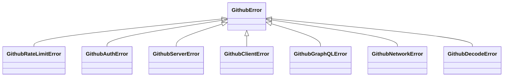
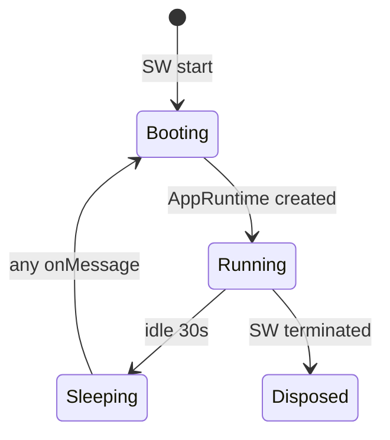
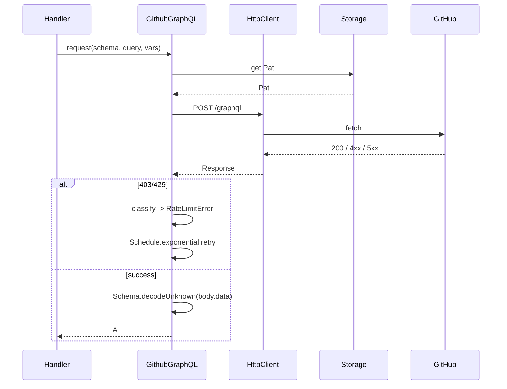

# Design: Effect-TS first migration

## Architecture target

```mermaid
flowchart TD
  UI[React UI / CS] -->|sendMessage| MSG[Schema-decoded Bus]
  MSG --> RT[ManagedRuntime SW]
  RT --> SVC[Service Layers]
  SVC --> GQL[GithubGraphQL]
  SVC --> STO[Storage]
  SVC --> LOG[Logger]
  SVC --> CACHE[Cache]
  SVC --> SEM[Semaphores]
  GQL --> HC[HttpClient platform]
  HC --> GH[(GitHub GraphQL)]
  UI <-->|.changes Stream| STORES[Stores SubscriptionRef]
  STORES --> RT
```



Legend: SW = Service Worker, CS = Content Script.

## Service tags / Layers
- `RgpLogger` (already exists as `RgpLoggerLive`).
- `Storage` — wraps `wxt` storage with Schema decode/encode and tagged errors.
- `HttpClient` from `@effect/platform-browser`'s `FetchHttpClient.layer`.
- `GithubGraphQL.request<A,I,R>(schema, query, vars, opts?)` returning `Effect.Effect<A, GithubError, GithubGraphQL>`. Encapsulates retry, timeout, tracing, Pat injection, response decode.
- `PreviewCache`, `HierarchyCache` — backed by `Cache.makeWith` (Effect's TTL cache replacing `_previewSetup` / `_hierarchySetup` Maps).
- `QueueState` — a `SubscriptionRef<QueueState>` for live progress; the background SW + content script both expose `.changes` to subscribers.
- `Concurrency` — three named `Effect.Semaphore`s: `duplicateSem (3)`, `bulkSem (3)`, `sprintEndSem (1)`. Replaces integer counters.
- Stores: `SelectionStore`, `ToastStore`, `QueueStore`, `CheckboxPortalStore` — each `Layer.effect(Tag, make)` returning a record `{ ref, ...mutators }`.

## Error ADT



Replaces single `GithubHttpError`. Retry policy filters on `_tag === 'GithubRateLimitError'` only.

## Schema policy
- Every message in `ProtocolMap` gets a `{ input, output }` `Schema.Struct`.
- Background handler ingress: `Schema.decodeUnknown(input)`. Egress: `Schema.encode(output)`.
- GraphQL responses decoded via `GithubGraphQL.request` taking the response schema. Decode failures → `GithubDecodeError` (not retried).
- Storage: each `storage.defineItem` wrapped by a `StoredSchema<A>` that decodes on read; corrupt reads return defaultValue and log a warning.
- Branded primitives: `ProjectId`, `ProjectItemId`, `IssueNumber`, `IssueDatabaseId`, `Pat`, `Login`, `RepoOwner`, `RepoName`.

## Concurrency model
- `lib/queue.ts` keeps public API (`processQueue`, `cancelQueue`, `subscribeQueueState`). Internals replace `activeFibers: Map + cancelledProcesses: Set` with `FiberMap.make<string>()`. Cancel becomes `FiberMap.remove(map, processId)` (auto-interrupt).
- `entries/background/concurrency.ts` becomes three Semaphores. `acquire/release` callers turn into `sem.withPermits(1)(effect)`.
- Timer-based eviction in `cache.ts` and `toast-store.ts` becomes `Effect.acquireRelease(setTimeout, clearTimeout)` inside a `Scope` so interruption guarantees timer cleanup.

## React integration

```ts
// src/lib/effect/use-subscription-ref.ts
export function useSubscriptionRef<A>(ref: SubscriptionRef.SubscriptionRef<A>): A {
  return useSyncExternalStore(
    (cb) => {
      const fiber = AppRuntime.runFork(
        Stream.runForEach(ref.changes, () => Effect.sync(cb))
      )
      return () => AppRuntime.runFork(Fiber.interrupt(fiber))
    },
    () => AppRuntime.runSync(SubscriptionRef.get(ref)),
  )
}
```

## ManagedRuntime lifecycle (background SW)



The runtime is recreated on every cold SW start, identical to current behavior. No persistence required — all in-memory state is already considered ephemeral.

## GraphQL request flow



## Risks
- Bundle size: `@effect/platform` adds ~25–40 KB gzipped. Mitigation: WXT chunk-splitting; verify post-build with `du -sh dist/chrome-mv3/*.js`.
- Test runtime: vitest setup must instantiate `AppRuntime` with test layers via `setupFiles` to avoid fiber leaks. New file: `vitest.setup.effect.ts`.
- Service-worker termination: ManagedRuntime auto-disposed when SW dies; cold start re-creates. Same lifetime as current module-level singletons.
- Backward compatibility: keep `gql(...)`, imperative store APIs, `withRateLimitRetry` as deprecated shims for one phase, then remove.
- Manifest permissions: HttpClient uses `fetch` only — no new permissions. `pnpm run check:manifest` keeps passing.

## Open / parking lot (not in this change)
- Replace `MutationObserver` callbacks with `Stream.async`.
- Move metrics (Effect `Metric.counter`) for queue throughput.
- Wire `Effect.Tracer` to a real exporter for production diagnostics.
