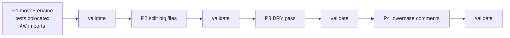

# Design: flat-layout refactor

## Target tree (six folders)

```
src/
  entries/        # WXT entry points, flat
  features/       # one file per feature (refined-github pattern)
  ui/             # shared Primer-aware UI building blocks
  background/     # background-only logic (handlers, helpers, services, cache)
  lib/            # framework-agnostic runtime + utilities + stores + schemas
  assets/         # static assets
```

## Move map (high-impact)

| Source | Destination |
| --- | --- |
| `components/bulk/*.tsx` | `features/*.tsx` |
| `components/sprint/sprint-modal.tsx` | `features/sprint-modal.tsx` (split into `sprint-modal.tsx` + `sprint-end-view.tsx` + `sprint-settings-view.tsx`) |
| `components/sprint/sprint-store.ts` | `lib/sprint-store.ts` |
| `components/hierarchy/*.tsx` | `features/*.tsx` |
| `components/ui/*` | `ui/*` |
| `components/{onboarding-coach,token-setup,debug-settings-card,checkbox-portal-host,toast-list,queue-tracker,keyboard-help-overlay}.tsx` | `features/*.tsx` |
| `entries/background/index.ts` | `entries/background.ts` |
| `entries/background/handlers/*` | `background/*` |
| `entries/background/services/*` | `background/*` |
| `entries/background/{cache,concurrency,helpers,types}.ts` | `background/*` (helpers split) |
| `entries/content/index.ts` | `entries/content.ts` |
| `entries/content/{content-ui,sprint-injections,hierarchy-injections,issue-detail-injections,table-enhancements}.ts(x)` | `features/*` |
| `entries/popup/{bootstrap,app}.tsx` | `entries/popup.tsx` (merged) |
| `entries/options/{bootstrap,app}.tsx` | `entries/options.tsx` (merged) |
| `lib/effect/runtime.ts` | `lib/effect-runtime.ts` |
| `lib/effect/use-subscription-ref.ts` | `lib/use-subscription-ref.ts` |
| `lib/effect/schemas/{name}.ts` | `lib/schemas-{name}.ts` |
| `lib/effect/services/graphql.ts` | `lib/graphql-service.ts` |
| `lib/effect/services/storage.ts` | `lib/storage-service.ts` |
| `lib/effect/services/http.ts` | `lib/http-service.ts` |
| `lib/graphql/{client,queries,mutations}.ts` | `lib/graphql-{client,queries,mutations}.ts` |
| `lib/__tests__/*.test.ts` | `lib/*.test.ts` (beside source) |
| `lib/__tests__/{vitest.setup.effect,effect-test-layers,effect-assert}.ts` | `lib/{vitest.setup,effect-test-helpers,effect-assert}.ts` |
| `lib/graphql/__tests__/client.test.ts` | `lib/graphql-client.test.ts` |
| `components/bulk/__tests__/bulk-random-assign-utils.test.ts` | `features/bulk-random-assign-utils.test.ts` |

## File-split plan

| File now | Lines | Becomes |
| --- | ---: | --- |
| `bulk-duplicate-modal.tsx` | 1855 | `features/bulk-duplicate-modal.tsx` (~450) + `bulk-duplicate-steps.tsx` (~450) + `bulk-duplicate-utils.ts` (~300); shared bits go to `field-helpers.tsx` |
| `bulk-actions-bar.tsx` | 1703 | `features/bulk-actions-bar.tsx` (~500) + `bulk-actions-dispatch.ts` (~200); inline lazy modals |
| `bulk-edit-modal.tsx` | 1665 | `features/bulk-edit-modal.tsx` (~400) + `bulk-edit-steps.tsx` (~450) + `bulk-edit-relationships.tsx` (~350) + `bulk-edit-utils.ts` (~200) |
| `bulk-handlers.ts` | 1262 | `background/bulk-handlers.ts` (~250 register) + `bulk-update.ts` (~450) + `bulk-position.ts` (~250) + `bulk-rename.ts` (~300) |
| `sprint-modal.tsx` | 1223 | `features/sprint-modal.tsx` (~400) + `sprint-end-view.tsx` (~350) + `sprint-settings-view.tsx` (~350) |
| `helpers.ts` (bg) | 1040 | `background/project-helpers.ts` (~250) + `relationship-helpers.ts` (~450) + `rest-helpers.ts` (~350) |
| `bulk-rename-modal.tsx` | 932 | `features/bulk-rename-modal.tsx` (~400) + `bulk-rename-preview.tsx` (~350) + `bulk-rename-utils.ts` (~180) |
| `bulk-move-modal.tsx` | 801 | `features/bulk-move-modal.tsx` (~500) + `bulk-move-utils.ts` (~200) |
| `primitives.tsx` | 660 | `ui/icons.tsx` + `ui/actions.tsx` + `ui/panel-card.tsx` + `ui/section-header.tsx` + `ui/progress-state.tsx` + `ui/status-banner.tsx` + `ui/step-indicator.tsx` + `ui/empty-state.tsx` + `ui/keyboard-hint.tsx` + `ui/app-shell.tsx` (~50–80 each) |
| `table-enhancements.ts` | 598 | `features/table-enhancements.ts` (~350) + `table-drag-and-drop.ts` (~250) |

## DRY consolidation

- `features/field-helpers.tsx` — single home for `formatIssueReference`, `getFieldIcon`, `getFieldOptionTooltip`, `getFieldSelectionTooltip`, `getFieldValueStepTooltip`, `summarizeText`, `summarizeIssueList`, `relationshipKey`, `createEmptyRelationshipUpdates`, `createEmptyRelationshipSelection`, `hasRelationshipOperations`. Currently duplicated across `bulk-edit-modal.tsx`, `bulk-duplicate-modal.tsx`, and `bulk-actions-bar.tsx`.
- `ui/icons.tsx` — single home for every `*Icon` (Octicon wrappers). `primitives.tsx` no longer mixes icons with layout components.

## Phasing



Each phase is one git commit so any phase can be reverted independently.

## Lowercase comment style

```ts
// before
// ─── Concurrency guards ───────────────────────────────────────────────────────
//
// The legacy imperative API (`isXFull`, `acquireX`, `releaseX`) is preserved so
// existing handlers continue to short-circuit when the queue is full.

// after
// concurrency guards: keep imperative api so existing handlers can short-circuit
// when queue is full. semaphores below let new effect handlers `withPermits`.
```

Rules: short, lowercase, kebab section banners (`// ── bulk update ──`), no JSDoc unless type-checked, no emojis.

## Risk + safety net

- Refactor is mechanical (move/rename/split) plus DRY (extract identical helpers). No GraphQL, queue, rate-limit, or storage logic changes.
- Anti-abuse rules preserved: no `Promise.all` for mutations, `sleep(1000)` between content-creating mutations, retry policy stays in `lib/graphql-service.ts`.
- Validation gate at the end of every phase: `pnpm install && pnpm typecheck && pnpm test && pnpm build:{chrome,firefox,edge}`.
- One commit per phase ⇒ clean `git revert` if a build fails.

## Out of scope

- No new features.
- No GraphQL query changes.
- No Effect-runtime restructuring (services / Tags / Layers stay identical).
- No CSS / Primer / Tippy / motion changes.
- No README / docs writing.
- safari build is not in the validation list.
